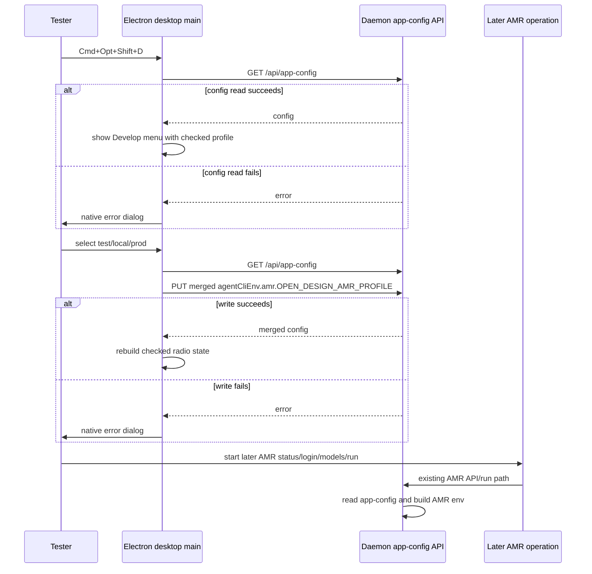

## Overview

### Problem Statement

Packaged Open Design needs a hidden desktop Develop menu for AMR testing.
Testers should be able to switch the packaged runtime's AMR Environment
Profile among `local`, `test`, and `prod` while reusing the same bundled Vela
/ AMR CLI binary.

### Goals

- Add a hidden desktop Develop menu toggle for packaged testing.
- Let the menu switch the AMR Environment Profile among `local`, `test`, and
  `prod`.
- Persist the selected profile through the existing app config path.
- Preserve the bundled Vela / AMR CLI binary and other AMR env overrides.
- Make failure visible when the menu cannot read or write configuration.

### Non-Goals

- Do not change the AMR CLI binary selection model.
- Do not redefine Open Design release channels as AMR environments.
- Do not change AMR account login semantics.
- Do not add mock or placeholder profile behavior.

### Success Criteria

- A packaged desktop tester can reveal a hidden Develop menu and choose one of
  `local`, `test`, or `prod`.
- The selected profile is persisted in app config without deleting unrelated
  `agentCliEnv` settings.
- New AMR operations use the selected AMR Environment Profile.
- The menu reports read/write failures instead of pretending the switch
  succeeded.

## Research

### Existing System

- The glossary defines **AMR Environment Profile** as the target AMR service
  environment a packaged runtime is configured to use, and separates it from
  release channel, account status, and app identity. Source:
  `CONTEXT.md:75-77`.
- The glossary states that AMR Environment Profile is independent from Open
  Design release channel identity. Source: `CONTEXT.md:93-97`.
- Desktop main already has a centralized native menu builder in
  `installDesktopMenu`, with App/File, Edit, View, Window, and Help menus.
  Source: `apps/desktop/src/main/index.ts:185-291`.
- The View menu already exposes Electron's `toggleDevTools`; no separate
  Develop menu exists in the current native template. Source:
  `apps/desktop/src/main/index.ts:233-245`.
- Packaged desktop passes a real daemon HTTP URL to desktop main through
  `discoverDaemonUrl`; comments state Node-side fetch must target the daemon
  sidecar HTTP URL, not the `od://app/` renderer URL. Source:
  `apps/packaged/src/index.ts:148-156`.
- `DesktopMainOptions` already models `discoverDaemonUrl` for packaged
  main-process API calls. Source: `apps/desktop/src/main/index.ts:105-117`.
- The daemon exposes `GET /api/app-config` and `PUT /api/app-config`, both
  guarded by same-origin/local validation. Source:
  `apps/daemon/src/server.ts:10193-10214`.
- App config writes are serialized per data directory to avoid losing
  concurrent read-modify-write updates. Source:
  `apps/daemon/src/app-config.ts:528-535`.
- `agentCliEnv` is the shared app-config shape for per-agent environment
  settings. Source: `packages/contracts/src/api/app-config.ts:6,28-32`.
- The app-config env allowlist permits AMR keys including
  `OPEN_DESIGN_AMR_PROFILE` and other AMR overrides such as `VELA_BIN`,
  `VELA_LINK_URL`, `VELA_RUNTIME_KEY`, and `VELA_OPENCODE_BIN`. Source:
  `apps/daemon/src/app-config.ts:157-165`.
- Packaged launch configuration already accepts AMR profile values
  `prod | test | local`. Source: `apps/packaged/src/config.ts:21-22`.
- Packaged config validation rejects unsupported packaged AMR profile values.
  Source: `apps/packaged/src/config.ts:118-122`.
- Packaged daemon spawn env forwards a baked packaged `amrProfile` as
  `OPEN_DESIGN_AMR_PROFILE` when present. Source:
  `apps/packaged/src/sidecars.ts:320-327`.
- Runtime AMR profile resolution defaults to `prod`; allowed runtime values
  are `prod`, `test`, and `local`; invalid values warn and fall back to
  `prod`. Source: `apps/daemon/src/integrations/vela-profile.ts:1-16`.
- AMR runtime env assembly maps `OPEN_DESIGN_AMR_PROFILE` into
  Vela-facing profile env for AMR runs. Source:
  `apps/daemon/src/runtimes/env.ts:88-98`.
- The AMR model endpoint resolves its probe by reading app config inside the
  request path, then builds a cache key that includes
  `OPEN_DESIGN_AMR_PROFILE`, `VELA_PROFILE`, credentials, and launch path.
  Source: `apps/daemon/src/server.ts:6454-6494`.
- AMR status, login, and logout routes each read app config inside the route
  handler before resolving AMR env. Source:
  `apps/daemon/src/server.ts:6501-6527,6575-6591`.
- New chat runs read app config before resolving the selected agent launch
  env, then use that env for AMR model preflight and child process spawn.
  Source: `apps/daemon/src/server.ts:11909-11963,12387-12398`.
- AMR login status and logout resolve the active AMR profile from the merged
  env supplied to the function. Source:
  `apps/daemon/src/integrations/vela.ts:190-205,244-255`.
- AMR model loading cache is keyed by caller-provided `cacheKey`; it keeps a
  separate state per key. Source:
  `apps/daemon/src/runtimes/amr-model-cache.ts:26-57,64-73`.
- The generic remembered live-model cache is keyed only by `agentId`, not by
  AMR Environment Profile. Source: `apps/daemon/src/runtimes/models.ts:8-30`.

### Design Inputs

- Handoff conclusion says no AMR runtime core change appears necessary; the
  menu can override AMR profile through app config using
  `agentCliEnv.amr.OPEN_DESIGN_AMR_PROFILE`. Source:
  `/private/tmp/open-design-amr-profile-packaged-handoff.md`.
- Handoff recommends desktop menu changes call daemon `GET /api/app-config`,
  merge `agentCliEnv.amr.OPEN_DESIGN_AMR_PROFILE`, and then call
  `PUT /api/app-config`; it explicitly recommends not writing
  `app-config.json` directly from Electron main. Source:
  `/private/tmp/open-design-amr-profile-packaged-handoff.md`.
- Handoff notes `od config set agentCliEnv` replaces the whole top-level
  `agentCliEnv` object, so callers must merge existing `agentCliEnv` before
  writing. Source:
  `/private/tmp/open-design-amr-profile-packaged-handoff.md`.

### Constraints & Dependencies

- The root repo guide requires reading module-level `AGENTS.md` files and
  keeping packaged runtime paths namespace-scoped and independent from ports.
  Source: `AGENTS.md` "Directory guide"; `apps/AGENTS.md` "Packaged runtime";
  `apps/packaged/AGENTS.md` "Rules".
- The repository values fast failure: required failed subprocesses, failed
  network calls, and violated invariants should surface as clear errors rather
  than fallback behavior. Source: `AGENTS.md` "Let It Crash / Fast Fail".
- Regular validation before marking work ready includes at least
  `pnpm guard`, `pnpm typecheck`, and package-scoped tests/builds matching
  touched files. Source: `AGENTS.md` "Validation strategy".

### Key References

- `CONTEXT.md`
- `/private/tmp/open-design-amr-profile-packaged-handoff.md`
- `apps/desktop/src/main/index.ts`
- `apps/packaged/src/index.ts`
- `apps/packaged/src/config.ts`
- `apps/packaged/src/sidecars.ts`
- `apps/daemon/src/app-config.ts`
- `apps/daemon/src/server.ts`
- `apps/daemon/src/integrations/vela-profile.ts`
- `apps/daemon/src/runtimes/env.ts`
- `packages/contracts/src/api/app-config.ts`

## Design

### Design Summary

Add the AMR Environment Profile switcher as a shared desktop main-process
Develop menu capability. The menu is hidden by default and can be toggled by a
desktop keyboard shortcut in both tools-dev and packaged desktop runs. The
shared path keeps development and packaged testing on the same implementation
surface instead of adding a packaged-only branch.

The menu persists the selected profile through the daemon app-config API by
merging `agentCliEnv.amr.OPEN_DESIGN_AMR_PROFILE` into the existing config.
It does not change release channel identity, app identity, AMR account status,
or the Vela / AMR CLI binary.

### Design Decisions

- Decision: Implement the hidden Develop menu as a shared desktop capability,
  enabled in both tools-dev and packaged desktop runs, rather than a
  packaged-only branch. Desktop main already centralizes native menu
  construction, and packaged desktop already delegates host behavior to
  `apps/desktop`; keeping one path reduces conditional behavior while allowing
  development runs to test the feature directly. Source:
  `apps/desktop/src/main/index.ts:185-291`;
  `apps/packaged/AGENTS.md` "Owns"; `apps/AGENTS.md` "Active apps".
- Decision: The menu changes only the **AMR Environment Profile**, not Open
  Design release channel identity, app identity, AMR account status, or CLI
  binary selection. Source: `CONTEXT.md:75-77,93-97`;
  `apps/daemon/src/app-config.ts:157-165`.
- Decision: The Develop menu visibility is process-local and resets to hidden
  on desktop restart. The shortcut toggles only the current Electron process's
  native menu template, keeping the entry as a temporary test surface rather
  than a persisted user preference. Source:
  `apps/desktop/src/main/index.ts:185-291`.
- Decision: The reveal shortcut is `Cmd+Opt+Shift+D` on macOS. Source: user
  decision, 2026-06-08.
- Decision: Switching the AMR Environment Profile must not automatically
  restart desktop or daemon, and normal use should not require a manual
  restart. AMR status, login, logout, model loading, and new chat runs already
  re-read app config in their request/run paths, and the AMR model loading
  cache is profile-sensitive through its cache key. Source:
  `apps/daemon/src/server.ts:6454-6494,6501-6527,6575-6591,11909-11963,12387-12398`;
  `apps/daemon/src/runtimes/amr-model-cache.ts:26-57,64-73`.
- Decision: Do not use restart as the fix for stale AMR model state. Add AMR
  Environment Profile into the remembered live-model cache key, because the
  current generic remembered model list is keyed only by `agentId`. Source:
  `apps/daemon/src/runtimes/models.ts:8-30`;
  `apps/daemon/src/server.ts:11973-12031`.
- Decision: Successful profile switches should update native menu checked
  state without a success dialog; failures should show a native error dialog.
  The feature lives in Electron main's native menu surface, so success feedback
  should stay in that surface and failures should remain visible. Source:
  `apps/desktop/src/main/index.ts:185-291`; `AGENTS.md`
  "Let It Crash / Fast Fail".
- Decision: Treat daemon app config as the source of truth for the currently
  selected AMR Environment Profile whenever the hidden Develop menu is shown or
  rebuilt. Desktop memory is only a last-known UI state after successful reads
  or writes. Source: `apps/daemon/src/server.ts:10193-10214`;
  `apps/daemon/src/integrations/vela-profile.ts:1-16`.
- Decision: Profile writes must be minimal merge updates that preserve the
  rest of `agentCliEnv`. `agentCliEnv` stores all per-agent environment
  settings, and AMR currently has other allowed keys that must survive a
  profile switch. Source: `packages/contracts/src/api/app-config.ts:6,28-32`;
  `apps/daemon/src/app-config.ts:157-165`;
  `/private/tmp/open-design-amr-profile-packaged-handoff.md`.
- Decision: The menu exposes only the explicit profiles `prod`, `test`, and
  `local`; it does not expose a separate clear/default action. Runtime default
  semantics already treat a missing profile as `prod`, and a hidden testing
  menu benefits from an explicit selected value. Source:
  `apps/daemon/src/integrations/vela-profile.ts:1-16`.
- Decision: Name the hidden top-level menu `Develop`, but keep the first
  version scoped to AMR Environment Profile switching only. Desktop already has
  normal View and Help items for DevTools and diagnostics, so this change should
  not become a general developer-tools menu. Source:
  `apps/desktop/src/main/index.ts:233-287`.

### Derived Rules

- The hidden menu starts absent from the native menu template.
- Pressing `Cmd+Opt+Shift+D` toggles the Develop menu visible/hidden for the
  current desktop process.
- The toggle state is not stored in `app-config.json`, packaged config, or
  another preferences file.
- On non-macOS platforms, use the Electron accelerator equivalent
  `Ctrl+Alt+Shift+D` unless the platform prevents registering it.
- After a successful profile switch, in-flight AMR runs or an already-running
  `vela login` process are not migrated; the new profile applies to subsequent
  AMR operations.
- Manual restart is only an operator workaround for unrelated stuck state, not
  part of the intended profile-switch workflow.
- AMR remembered model state must be isolated by AMR Environment Profile; other
  agents can keep their current agent-only cache behavior.
- Profile choices are radio-style menu items for `local`, `test`, and `prod`.
- After a successful switch, rebuild the menu so the selected profile is
  checked.
- On read/write failure, show a native error dialog and leave the last known
  checked state unchanged.
- Showing the Develop menu first reads `GET /api/app-config`; if the read
  fails, show a native error dialog and keep the menu hidden.
- Missing `agentCliEnv.amr.OPEN_DESIGN_AMR_PROFILE` displays as `prod`, matching
  AMR runtime default semantics.
- Writing a selected profile performs `GET /api/app-config`, merges
  `agentCliEnv.amr.OPEN_DESIGN_AMR_PROFILE`, then sends `PUT /api/app-config`.
- The write must preserve other AMR env keys, other agent env entries, and
  unrelated app-config fields.
- The menu implementation does not use a replace-whole-object config command
  path for `agentCliEnv`.
- Selecting `prod` writes `OPEN_DESIGN_AMR_PROFILE: "prod"` explicitly instead
  of deleting the key.
- The menu validates choices against `prod | test | local` before writing.
- Menu structure is `Develop` -> `AMR Profile` -> `prod`, `test`,
  `local`.
- This spec does not add updater, diagnostics, DevTools, feature flags, or
  other testing actions to `Develop`.
- This hidden native desktop testing affordance does not add a new web UI or
  CLI surface.

### System Structure

- `apps/desktop/src/main/index.ts`
  - owns the hidden menu state, shortcut registration, native menu rebuild, and
    dialog errors.
  - reads and writes app config through the daemon URL supplied by
    `discoverDaemonUrl`, or the web/dev URL fallback where appropriate.
- `apps/daemon/src/runtimes/models.ts`
  - extends remembered live-model cache helpers to support an optional cache
    scope for AMR Environment Profile while preserving current agent-only
    behavior for non-AMR runtimes.
- `apps/daemon/src/server.ts`
  - passes AMR profile-aware cache scope when remembering or reading AMR live
    model lists during run preflight.
- Tests cover menu construction/toggle behavior, config merge behavior, and
  AMR remembered model isolation by profile.

### System Procedure

### Interfaces / APIs

- Existing daemon API only:
  - `GET /api/app-config`
  - `PUT /api/app-config`
- Native menu labels:
  - `Develop`
  - `AMR Environment Profile`
  - `prod`
  - `test`
  - `local`
- Accelerators:
  - macOS: `Command+Option+Shift+D`
  - non-macOS: `Control+Alt+Shift+D`

### Change Scope

Impact Areas:

- Desktop native menu behavior changes, but only behind a hidden shortcut.
- Daemon runtime model-memory behavior changes for AMR profile isolation.
- No database/schema changes.
- No web UI, CLI command, route, contract, release-channel, or packaged
  identity change.
- No new i18n keys; native hidden testing menu labels can remain hardcoded.

Planned File Changes:

- `apps/desktop/src/main/index.ts`: add hidden Develop menu toggle, AMR profile
  menu construction, app-config read/write helpers, and failure dialogs.
- `apps/desktop/tests/main/*`: add or extend main-process tests for hidden menu
  behavior and app-config merge preservation.
- `apps/daemon/src/runtimes/models.ts`: add scoped remembered model cache keys.
- `apps/daemon/src/server.ts`: use AMR profile-aware remembered model scope in
  AMR run preflight.
- `apps/daemon/tests/*`: add focused coverage for AMR remembered model
  isolation by profile.

### Edge Cases

- Missing configured profile displays and writes as explicit `prod`.
- Invalid profile values in app config display as `prod` to match runtime
  default behavior, but the menu only writes valid `prod | test | local`.
- Daemon URL unavailable, config read failure, and config write failure all
  surface through native error dialogs.
- Concurrent app-config changes are preserved by reading fresh config before
  each write and letting daemon serialized writes handle overlap.
- In-flight AMR runs and active `vela login` children keep their original env.
- Stale remembered AMR model lists must not leak across profiles.

### Verification Strategy

- Run focused desktop main-process tests for menu toggle and config merge
  behavior.
- Run focused daemon tests for profile-scoped remembered model cache behavior.
- Run package typechecks for touched desktop and daemon packages.
- Before ready-for-PR, run repository baseline validation required by root
  guidance: `pnpm guard` and `pnpm typecheck`.

## Plan

### Step 1: Hidden Desktop Menu

Type: AFK
Goal: Add the shared hidden Develop menu with process-local shortcut toggle and
native error handling.
Scope: Update desktop main menu construction, register the accelerator, read
current profile from app config when revealing the menu, and add focused
desktop tests for hidden/visible menu state and failed reads.
Depends on: None

### Step 2: Profile Config Writes

Type: AFK
Goal: Persist profile selections through a minimal app-config merge.
Scope: Add desktop helper logic for read-merge-write profile updates, preserve
other `agentCliEnv` entries, update checked radio state on success, and test
merge preservation and write failure behavior.
Depends on: Step 1

### Step 3: AMR Model Cache Isolation

Type: AFK
Goal: Prevent stale remembered AMR model lists from leaking across AMR
Environment Profiles.
Scope: Extend remembered model cache helpers with an optional profile-aware
scope, wire AMR run preflight to use the selected profile, preserve non-AMR
agent-only behavior, and add daemon tests.
Depends on: None

### Step 4: Validation Pass

Type: AFK
Goal: Verify the complete change against focused tests and repo-level checks.
Scope: Run focused desktop and daemon tests, package typechecks for touched
packages, then `pnpm guard` and `pnpm typecheck`.
Depends on: Step 1, Step 2, Step 3

## Notes

<!-- Optional sections — add what's relevant. -->

### Progress

- [x] Step 1: Hidden Desktop Menu
- [x] Step 2: Profile Config Writes
- [x] Step 3: AMR Model Cache Isolation
- [x] Step 4: Validation Pass

### Implementation

- `apps/desktop/src/main/index.ts`
  - Added a process-local hidden `Develop` menu toggled by
    `Command+Option+Shift+D` on macOS and `Control+Alt+Shift+D` elsewhere.
  - Added `Develop -> AMR Profile -> prod/test/local` radio menu
    items.
  - Reads current profile from `/api/app-config` before showing the menu.
  - Writes selected profile by merging
    `agentCliEnv.amr.OPEN_DESIGN_AMR_PROFILE`, preserving other app config and
    AMR env overrides.
  - Surfaces daemon URL, read, write, invalid response, and shortcut
    registration failures through native error dialogs.
- `apps/desktop/tests/main/amr-environment-profile-menu.test.ts`
  - Added focused helper coverage for profile normalization, config merge
    preservation, missing env creation, and menu radio structure.
- `apps/daemon/src/runtimes/models.ts`
  - Added optional remembered live-model cache scope while preserving existing
    agent-only behavior when no scope is supplied.
- `apps/daemon/src/server.ts`
  - Scoped AMR remembered live-model reads/writes by resolved AMR Environment
    Profile during AMR run preflight.
- `apps/daemon/tests/runtimes/resolve-model.test.ts`
  - Added AMR profile-scoped remembered model isolation coverage.

### Verification

- `pnpm exec vitest run -c vitest.config.ts tests/runtimes/resolve-model.test.ts`
  from `apps/daemon`: passed.
- `pnpm exec vitest run -c vitest.config.ts tests/main/amr-environment-profile-menu.test.ts`
  from `apps/desktop`: passed.
- `pnpm --filter @open-design/daemon typecheck`: passed.
- `pnpm --filter @open-design/desktop typecheck`: passed.
- `pnpm typecheck`: passed.
- `pnpm guard`: failed on the pre-existing `tools/pr/` top-level tools
  allowlist violation. The initial sandbox run also failed before checks with
  `listen EPERM` from `tsx`; the elevated rerun reached repository checks and
  failed only on `tools/pr/`.
- An accidental broad `pnpm --filter @open-design/daemon test --
  tests/runtimes/resolve-model.test.ts` run invoked the wider daemon suite and
  reported unrelated existing failures/timeouts; focused daemon coverage above
  passed with the direct Vitest command.
